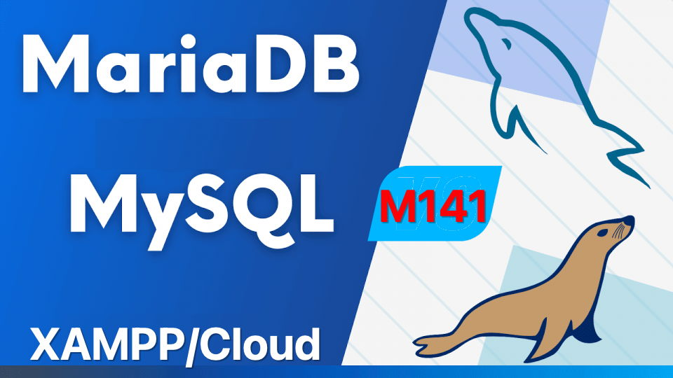
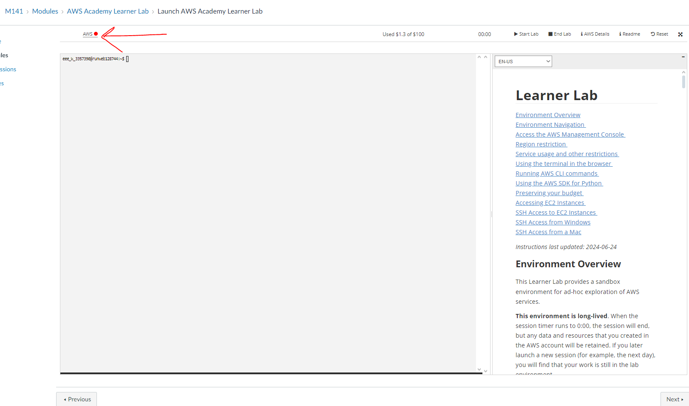
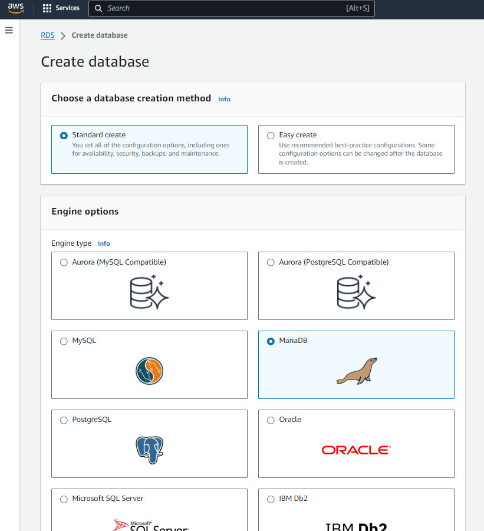
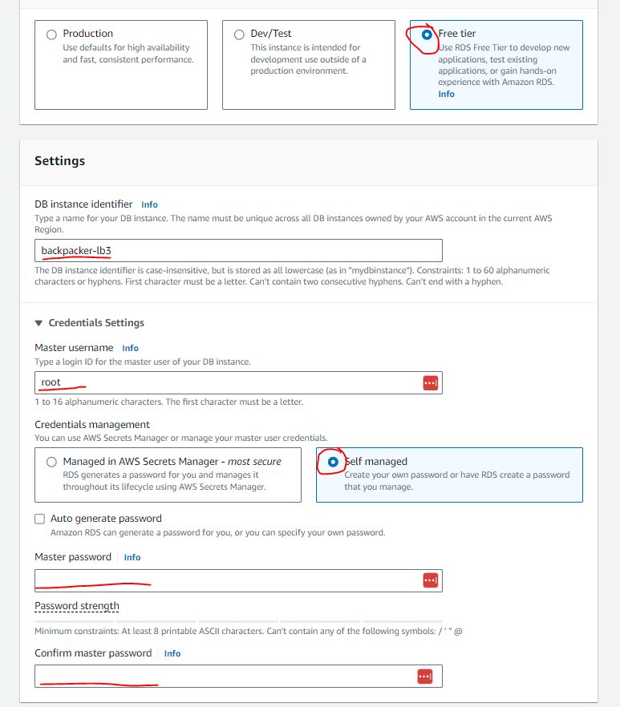
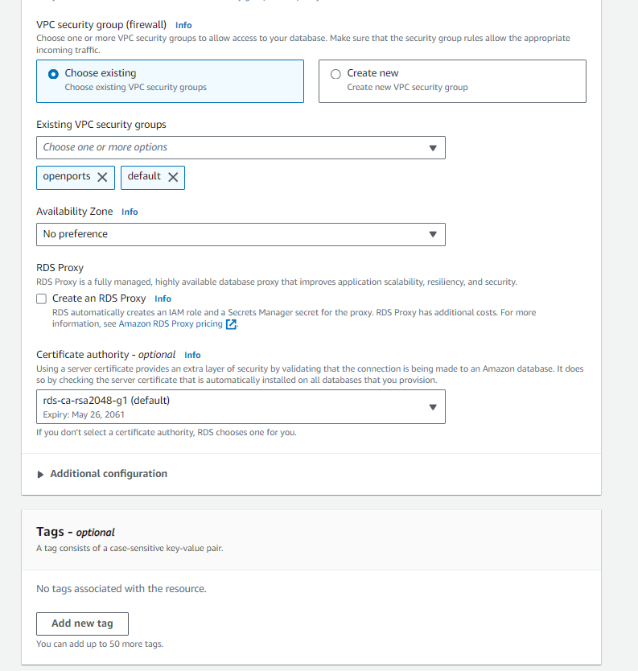
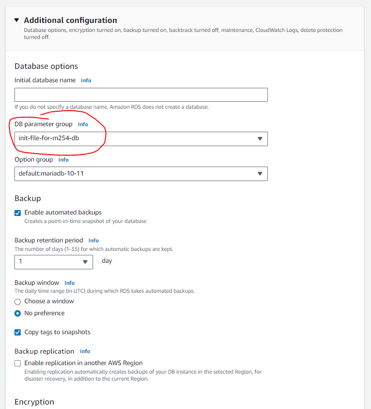
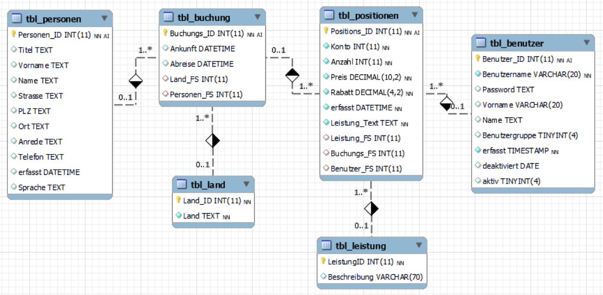

# M141 - LB3 - DB-Systeme in Betrieb nehmen

*Autoren: Zahid und Ilja*  
*Empfänger: Herr Kellenberger*  
*Abgabetermin: 11.7.2024*

---

## Aufgabenstellung

Eine kleine Jugendherberge verwaltet ihre Übernachtungen und die Zugänge der Angestellten (Benutzer) in einer kleinen Access-Datenbank. Nun möchte der Betreiber die Datenbank (Backpacker) auf eine schnellere MySQL-Datenbank umstellen. Er hat die bestehende Struktur in einem SQL-DDL-Skript und die Daten als CSV-Datei abgelegt. Die Struktur und die Daten sind möglicherweise nicht ganz konsistent, was überprüft werden sollte: Nach dem Laden der Datenbasis in ein lokales DBMS soll diese konsolidiert werden (Testen und Optimieren). Für den produktiven Betrieb soll die Datenbasis dann auf einem evaluierten, sicheren Cloud-DBMS laufen, d.h. dorthin migriert werden.

---

## Anforderungsdefinition

Unser Datenbanksystem sollte eine kleine und private Datenbank für eine Jugendherberge in der Cloud zur Verfügung stellen. Hier liste ich auf, was wir dafür brauchen/machen werde.

### 1. Lokale DBMS (z.B. MariaDB auf XAMPP)
- **ERD 2. NF:**
  - Backpaper-Schema
- **Zugriffsberechtigungen:**
  - Zugriffsmatrix (mindestens ein Benutzer pro Gruppenrolle)
  - Testprotokolle für Rollen und Benutzer
  - SQL-Skripte (DCL)
- **DB-Daten:**
  - Import der Backpacker CSV-Dateien
  - SQL-Skripte (DML)
  - Bereinigung der Datenbank (FK, Index, Constraints)
- **Testen:**
  - Testprotokolle für Datenkonsistenz
  - SQL-Skripte (Testdaten für Migration)

### 2. Remote Cloud-DBMS (z.B. MariaDB auf AWS)
- **Setup Cloud DBMS**
- **Betrieb:**
  - Sicherstellung des Cloud DBMS für den produktiven Betrieb
  - Konfigurationen für den produktiven Betrieb -> .ini

### 3. Automatisierte Migration
- **Lokale DBMS auf Cloud-DBMS migrieren**
  - **Berechtigungen:**
    - Automatisierte Übertragung der Zugriffsberechtigungen
    - Testprotokolle für Rollen und Benutzer
    - SQL-Skripte (DCL)
  - **Daten:**
    - Automatisierte Übertragung der Struktur und Daten
    - SQL-Skripte (DDL & DML)
    - Datenbankbereinigung
  - **Testen:**
    - Testprotokolle zur Überprüfung der Datenkonsistenz anhand der Testdaten der lokalen DB
    - SQL-Skripte

### 4. Protokollierung
- Vollständige und nachvollziehbare Dokumentation

---

## RDBMS Vergleich

Wir mussten herausfinden welches Cloud DB Angebot wir nutzen wollten. Wir entschieden und für AWS beim Anbieter da wir dies beide schon kannten. Wir stellten uns diese zur Auswahl.

| Größe     | vCPUs | Arbeitsspeicher (GiB) | Speicher (GB) | Netzwerkleistung | Zweck                                            |
|-----------|-------|-----------------------|---------------|------------------|-------------------------------------------------|
| db.t3.micro | 2     | 1                     | bis zu 16 GiB | Bis zu 5 Gigabit | Einstiegsinstanz für Test- und Entwicklungszweck |
| db.m5.large | 8     | 8                     | bis zu 6 TB   | Bis zu 10 Gigabit | Allzweck-Instanz für kleine bis mittlere Datenbanken |
| db.r5.2xlarge | 64    | 64                    | bis zu 6 TB   | Bis zu 10 Gigabit | Instanz mit hohem Speicher für große Datenbanken und hohe Arbeitslasten |

Wir entschieden uns für die db.t5.micro, da unsere Datenbank kein Corporate Level erreichen wird, sondern eher im finanziell erschwinglichen Rahmen bleiben sollte.

---

## SMART-Ziele

### Innerhalb des Zeitplans fertig werden
- **Spezifisch**: Das Projekt soll innerhalb von 10 Arbeitstagen abgeschlossen werden, einschließlich aller Tests und Dokumentation.
- **Messbar**: Die Aufgaben und Tests sind bis zum letzten Arbeitstag abgeschlossen.
- **Akzeptiert**: Beide Teammitglieder, Zahid und Ilja, sind einverstanden mit dem Zeitrahmen.
- **Realistisch**: Mit dem zur Verfügung stehenden Zeitbudget (9-12 Lektionen + Heimarbeit) ist der Zeitplan realisierbar.
- **Terminiert**: Die Frist für den Abschluss des Projekts ist der 10. Arbeitstag.

### Eine Note von mindestens 5.6 erhalten
- **Spezifisch**: Das Ziel ist es, eine Gesamtnote von mindestens 5.6 für das Projekt zu erzielen.
- **Messbar**: Die Note wird durch die in der Bewertungstabelle festgelegten Punkte berechnet.
- **Akzeptiert**: Beide Teammitglieder streben dieses Leistungsniveau an.
- **Realistisch**: Durch sorgfältige Arbeit und Erfüllung aller Bewertungskriterien ist dieses Ziel erreichbar.
- **Terminiert**: Die Note wird am Ende des Projekts vergeben.

### Unser Wissen in MySQL-Server unter Beweis stellen
- **Spezifisch**: Während des Projekts wird die Migration und Verwaltung der Datenbank mithilfe eines MySQL-Servers durchgeführt.
- **Messbar**: Der erfolgreiche Abschluss der Migration und die korrekte Funktion der Datenbank dienen als Nachweis.
- **Akzeptiert**: Beide Teammitglieder sind bereit, ihr Wissen und ihre Fähigkeiten in diesem Bereich zu demonstrieren.
- **Realistisch**: Beide Teammitglieder haben ausreichende Kenntnisse und Zugang zu Ressourcen, um dieses Ziel zu erreichen.
- **Terminiert**: Die Demonstration des Wissens erfolgt kontinuierlich während des Projekts und wird am Ende bewertet.

### Alle Projektziele und anforderungen erfüllen
- **Spezifisch**: Alle im Product Backlog und in den Bewertungskriterien festgelegten Anforderungen und Aufgaben werden vollständig und korrekt umgesetzt.
- **Messbar**: Die Erfüllung der Anforderungen wird durch die abschließende Projektbewertung und das Testprotokoll überprüft.
- **Akzeptiert**: Beide Teammitglieder sind sich der Anforderungen bewusst und streben deren vollständige Umsetzung an.
- **Realistisch**: Die Anforderungen sind mit den verfügbaren Ressourcen und dem Zeitrahmen umsetzbar.
- **Terminiert**: Die Erfüllung der Anforderungen wird am Ende des Projekts überprüft.

### Eine funktionierende und optimierte in der Cloud gehostete DB bereitstellen
- **Spezifisch**: Die Datenbank soll erfolgreich von Access nach AWS  migriert und anschließend auf ein Cloud-DBMS übertragen werden, wo sie für den produktiven Betrieb optimiert ist.
- **Messbar**: Der Erfolg wird durch die Funktionsfähigkeit der Cloud-DBMS und das Vorhandensein aller Daten und Berechtigungen überprüft.
- **Akzeptiert**: Beide Teammitglieder sind bereit, die notwendigen Schritte zur Erreichung dieses Ziels zu unternehmen.
- **Realistisch**: Die Migration und Optimierung sind mit den vorhandenen Ressourcen und dem Fachwissen durchführbar.
- **Terminiert**: Die funktionierende und optimierte Cloud-DBMS soll bis zum Ende des Projekts bereitgestellt sein.

---

## Zeitplan und Aufgabenteilung

| Tag  | Aufgabe                                                      | Verantwortlich |
|------|--------------------------------------------------------------|----------------|
| 1-2  | Definition der Infrastruktur und Anforderungen               | Zahid, Ilja    |
| 3-4  | Setup des lokalen DBMS und Import der Daten                  | Zahid, Ilja    |
| 5-6  | Datenbereinigung und Konsolidierung                          | Ilja           |
| 7    | Umsetzung Zugriffsberechtigungen                             | Zahid, Ilja    |
| 8-9  | Testen der Datenkonsistenz und Optimierung                   | Ilja           |
| 10   | Migration auf Cloud-DBMS                                     | Ilja           |
| 11   | Testen der Cloud-Datenbank                                   | Ilja           |
| 12   | Erstellung der Dokumentation und Testprotokolle              | Zahid, Ilja    |

---

## Umsetzung

### SQL

Wenn sie [diesem Protokoll](./protokoll.md) nacharbeiten, kommen sie zu unserem Ergebniss. Logischerweise haben wir noch viel anderes Probiert und getestet, dies würde aber den Rahmen des Protokollierungsaufwandes sprengen. 

### AWS

Wir entschieden uns, wie oben beschrieben, für die "db.t3.micro" Datenbankgrösse auf AWS. Um die letzten zwei Schritte des [Protokolls](./protokoll.md) durchzuführen muss man also diese Instanz zum laufen bekommen und sich damit verbinden. Hier beschreibe ich wie dies geht.

##### learner lab starten

auf "Start" klicken, wenn der rote Punkt grün wird, läuft es.

##### DB Erstellen

Danach auf AWS zu RDS und "Create Database" navigieren. Hier wählen wir "standart create" und "MariaDB" als RDBMS.
 
hier wählen wir "free tier", dann geben wir der DB einen Namen und ändern den Nutzer Admin zu Root. Danach setzen wir ein Sinvolles Passwort.
 
hier wählen wir noch eine Security group welche den Port 3306 auf offen gesetzt hat. Diese muss man beim ersten mal selber erstellen.

hier können wir noch eine Eigene Parameter group angeben. Diese ist für uns wie das my.ini file auf XAMPP. Ich habe dort die Parameter "wait_timeout" auf 4 std. reduziert und "max_connections" auf 5 gesetzt. Dabei erhoffe ich mir, dass die DB sicherer ist.

### Optimierung
- Parameter Group erstellt und angewendet um DB zu sichern
- Fremdschlüssel constraints erstellt um Datenintegrität zu gewährleisten
- Indexes erstellt um die Antwortzeit der DB zu reduzieren
- (fast) Alle Befehle in Scripts zusammengefasst 
- Alle skripts so gestaltet, dass sie keine Tabellen usw doppelt erstellen, z.b. "drop table if exists" vor "create table"

### Erkenntnisse

Wir lernten wie man mit User Berechtigungen in MariaDB/MySQL umgeht, wie man Indexes erstellt, wie man constraints definiert und sammelten Übung mit Befehlen die wir schon kannten. Zudem arbeiteten wir wieder einmal mit AWS.

### Unsere scripts passten wir diesen Infos an.

**Zugriffsmatrix**

|  *DB backpacker\_lb3*     |      Select          |  Insert     |Update|   Delete    |
|---------------------------|----------------|-------|-------|-------|
| *Benutzergruppe:*         | **Benutzer**   |       |       |       |
| Tabellen - Attribute      | S              | I     | U     | D     |  
| tbl\_personen             | **x**          |       | **x** |       |  
| tbl\_benutzer             |                |       |       |       |  
| **-** Passwort            | --             | --    | --    | --    |  
| **-** deaktiviert         | **x**          | --    | --    | --    | 
| **-** restliche Attribute | **x**          | **x** | **x** | --    |  
| tbl\_buchung,   tbl\_positionen | **x**          | **x** | **x** | **x** |   
| tbl\_land,    tbl\_leistung   | **x**          |       |       |       |

|  *DB backpacker\_lb3*     |      Select          |  Insert     |Update|   Delete    |
|---------------------------|----------------|-------|-------|-------|
| *Benutzergruppe:*         | **Management**   |       |       |       |
| Tabellen - Attribute      | S              | I     | U     | D     |  
| tbl\_positionen,   tbl\_buchung             | **x**          |       |       |       |  
| restl. Tabellen           | **x**          | **x** | **x** | **x** |   

*S = Select, I = Insert, U = Update, D = Delete, -- = nicht möglich, - = nicht mehr möglich*

**Bewertung**

| #  | Einträge (Arbeitspakete)      | Vorgaben                                        | Max. Punkte |
|----|-------------------------------|-------------------------------------------------|--------|
| 0  | Definition Infrastruktur       | Anforderungsdefinition, Evaluation Cloud RDBMS  | 4      |
| 1  | Lokale DBMS                    | -                                               |        |
| 1.1| ERD 2.NF                       | Backpacker-Schema, Backpacker DDL               |        |
| 1.2| Zugriffsmatrix                 | Zugriffsmatrix                                  |        |
| 1.3| Zugriffsberechtigungen         | Gemäß Zugriffsmatrix, Testprotokolle            | 4      |
| 1.4| DB Daten                       | Import CSV-Dateien, DB bereinigen               | 4      |
| 1.5| Testen                         | Testprotokolle Datenkonsistenz                  | 2      |
| 2  | Remote Cloud-DBMS              | -                                               |        |
| 2.1| Setup Cloud DBMS               | Installation und Setup                          | 4      |
| 2.2| Betrieb                        | Cloud DBMS für produktiven Betrieb sichern      | 4      |
| 3  | Automatisierte Migration       | -                                               |        |
| 3.1| Berechtigungen                 | Zugriffsberechtigungen übertragen, Testprotokolle | 4    |
| 3.2| Daten                          | Struktur und Daten übertragen, DB bereinigen    | 4      |
| 3.3| Testen                         | Testprotokolle Datenkonsistenz                  | 2      |
| 4  | Protokollierung                | Dokumentation aller Schritte                    | 4      |
|    | Demo                           | + Demo 3 User auf Cloud-RDMS                    | 4      |
|    | **Max. Punkte**                |                                                 | **40** |

---

## Testprotokol

| Test ID | Datum       | Beschreibung des Tests                                              | Erwartetes Ergebnis                                 | Erhaltenes Ergebnis                                | Funktioniert (Ja/Nein) | Wie wurde getestet (Command)         |
|---------|-------------|---------------------------------------------------------------------|----------------------------------------------------|---------------------------------------------------|------------------------|--------------------------------------|
| 1       | 2024-07-01  | Überprüfung der Tabellenstruktur nach Import                        | Alle Tabellen sind vollständig und korrekt         | Alle Tabellen sind vollständig und korrekt         | Ja                     | `SHOW TABLES;`, `SELECT * FROM <alle tabellen>;`                       |
| 2       | 2024-07-02  | Testen ob alle Benutzer erstellt sind                                | Alle Benutzer sind korrekt erstellt                | Alle Benutzer sind korrekt erstellt                | Ja                     | `SELECT user, host FROM mysql.user;`         |
| 3       | 2024-07-03  | Überprüfung der Zugriffsmatrix                                      | Alle Benutzer haben korrekte Rechte                | Alle Benutzer haben korrekte Rechte                | Ja                     | `SHOW GRANTS FOR 'user'@'host';`|
| 4       | 2024-07-04  | Testen der Berechtigungen (CRUD-Operationen)                        | Benutzer können nur ihre erlaubten Aktionen durchführen | Benutzer können nur ihre erlaubten Aktionen durchführen | Ja                     | `INSERT INTO tbl_personen VALUES ...`|
| 5       | 2024-07-06  | Überprüfung auf Duplikate                                           | Keine Duplikate vorhanden                          | Keine Duplikate vorhanden                          | Ja                     | dupe.sql script |
| 6       | 2024-07-07  | Testen der Zugänglichkeit des SQL-Servers im Web                    | Zugriff auf den SQL-Server über das Web möglich    | Zugriff auf den SQL-Server über das Web möglich    | Ja                  | SQL Client Zugriff      |

